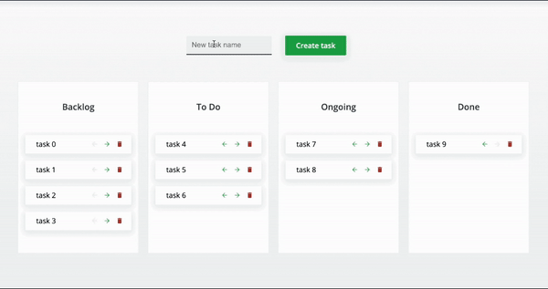

# Full Stack Take-Home Challenge

## Introduction

This was an exceptionally large take-home full stack TypeScript kanban board challenge I did for a small company in Atlanta. I worked on it in a marathon between the afternoon of Thursday April 28th and the morning of Monday May 2nd. I didn't get the job but I feel in my heart I came in second place to whoever did. My code review interview with three engineers included a lot of praise for how dedicated I went about my task.

You can see the original take-home challenge documentation below, but in short I was asked to take an organized but nearly empty back+front-end monorepo that was initialized with [Nx](https://nx.dev/), which was new to me.

I just wanted to grab this challenge and treat it like a personal project of mine. To, in a short amount of time, build it in such a way that I feel would provide a full impression of how I can build a webapp... in a rush.

### What I was assigned

On the backend I was to build a REST API with an actual database backing it. I was directed to use [Nest.js](https://nestjs.com/) (a robust and opinionated evolution of express.js) to handle requests, [TypeORM](https://typeorm.io/) for the framework that negotiates between the business logic and the database, and SQLite3 for the database.

On the front-end they suggested [React-Query](https://react-query.tanstack.com/), [Axios](https://axios-http.com/), and [Chakra-UI](https://chakra-ui.com/). I ended up skipping Chakra (except their icons library) and wrote all the styling myself from scratch using [styled-components](https://styled-components.com/).

The basic example they provided:

### What I turned in

My end result (be sure to watch at least the 50 sec mark):

https://user-images.githubusercontent.com/2433505/169069790-2fcfebcc-cea0-4212-9a54-fdd31603fe00.mov

_Except for the toasts that pop up in the corner all styling is original. It's not amazing, but considering I did it in one day I'm pretty content with it._

### What I felt good about

- I never used Nx, NestJS, SQLite3, TypeORM, nor React-Query before... but I learned them all and became a fan
  - NestJS proved to be a massive headache to write tests for but I learned how to, leaving solution comments on GitHub and Stack Overflow for others
- I wrote full unit and E2E tests for the backend, including even mocking the database
- I added optimistic updates to the UI
  - This wasn't necessary, but I wanted it anyway
- I added the ability to add, edit, delete, and move Categories
- I added the ability to sort Tasks
- I added the ability to edit the names of Tasks and Categories
- I added an expanding functionality to show additional details for Tasks

https://user-images.githubusercontent.com/2433505/169074567-283d5ce5-fc7d-4b8e-98a7-27bd8a3f2b49.mov

_Unit and e2e tests for the backend._

### What I didn't get to

- Drag-and-drop - I ran out of time (I set myself a deadline of Monday morning), but I've done this before
- Task tagging - Again, out of time, though this is isn't at all difficult - it just takes time

### This isn't all I can do

I've spent time working within a medium-sized org (Accretive, 5 years) and a gigantic org (Facebook, 2 years). But I've had a lot of fun making stuff on my own. And a great thing about it is I can show them to you!

I've done far more complicated backends with GraphQL [just glance at my API documentation](https://github.com/TiE23/metric-teacher/tree/master/server#graphql-api-documentation) for [Metric-Teacher](http://metric-teacher.com/), a single-page application with user accounts, moderation, user contribution features, and progress tracking.

For the frontend I've had success with Metric-Teacher and, more recently, [building custom tool UIs](https://github.com/TiE23/sab-f1-ui#prototype-interface) and complex [animated elements](https://github.com/TiE23/sab-f1-ui#demos) for my F1 Broadcast Emulator project.

# Project Notes

## About the Backend

I wrote this app while using Node v16.13.0. So, if something goes wrong, please try switching to that version.

Knowing what I wanted to build on the frontend I just went whole-hog and dove into 100% exclusively back-end development. Learning to build it with your team's style of using Nest and TypeORM proved to be a real learning experience as I haven't encountered them before. But as a result, I think they both have a new fan (me).

I used Postman (folder config committed to root) for most of my fiddling.

I didn't maybe build the most production-ready solution, and I might've chosen to use params more often than some might like (yes, I will admit that moving and repositioning a Task from one Category to another with an endpoint of `':taskId/moveto/:categoryId/:newPosition'` is maybe weird - I just went with it!), and I chose a fun but weird ordering solution involving "lexical sorting", but I really just had a lot of fun with it.

Oh, and yes, I wrote a full suite of e2e test using a test database. Every Task and Category endpoint is covered.

### Things I did; Features, Bonuses, and Stretch Goals

- Stretch: Total e2e testing for all Task and Category endpoints. With a real in-memory DB. Seriously.
  - Also the e2e tests totally helped me make improvements.
    - Testing: actually good to do? (???)
- Feature: Unit testing for Task and Category controllers
- Feature: Unit testing for business logic
- Feature: A very novel (read: weird and fun but would **never** make it past the design phase in a realworld situation) ordering solution for Tasks and Categories using a thing called 'lexical ordering'. Literally, it's something I thought up on the toilet and thought it would be fun. 🚽
- Feature: Took advantage of cascading updates. Tasks are created through a Category directly. Deleting a Category deletes its Tasks as well.
- Feature: Implemented a special fix using Subscribers to make sure that the `updated_at` column is updated through relationship changes (otherwise they wouldn't)
- Tech: TypeORM, NestJS, SQLite
- Bonus: Included my Postman folder

## About the Frontend

First thing I want to point out is that I didn't have the time to combine the Category/Task title editor component (and surrounding state and cache management) into a single shared component to split between Category and Task. I was working so quickly that instead of figuring out how to share them (which I do in NewEntityForm) I essentially just wrote the edit tool for Task and copied the code for Category.

Also this is the first time I've ever used `react-query` so I have a strong hunch I didn't do it the best way possible.

### Things I did; Features, Bonuses, and Stretch Goals

- Bonus: Create, Move, and Rename Categories!
- Bonus: Rename Tasks (click the title and then click the edit button, press enter to save)
- Bonus: Change the sorting of Tasks! Up and down. Lots of fun.
- Strech: Display `created_at` and `updated_at` with decent locale date parsing
- Bonus: Cool custom hooks
  - `useFocus()` (auto focus input on mounting)
  - `useHideOnClickOutside()` (close something by clicking away)
  - `useHover()` (because :hover isn't cool enough)
- Thing I did: Styled-Components
  - I skipped the Chakra UI component library (I already learned so much) and just rolled my own components made with Styled-Components
  - Used a central theme for some basic consistency
  - Managed to hit a lot of features of Styled-Components in such a short amount of time
    - Props
    - Extending styles
    - Using themes
    - Using `css`\`` template strings
    - Animated with `@react-spring/web`'s `animate()` HOC
    - Only major thing I can think of that I didn't do is use `.attrs()` anywhere... hmm
- Bonus: Animated transitions using both CSS and react-spring
- Bonus: Toasts pop up to confirm successes or explain errors
- Bonus: I dunno, I just like how much fun I have with TypeScript in general with generics, utility types, disjoint unions

## Stretch goals I didn't get to because I ran into my deadline

I'll probably still do these anyway as time permits this week.

- I didn't add logging to the backend
- Didn't get to Tags, but I know how I'd go about doing them...
  - Backend
    - New Tag and TagsCollection Entities
    - TagsCollection Controller and Service
      - ManyToMany relation between both Task and Tag
      - OneToMany relation from TagsCollection to Tag
    - Create and Delete Tags from TagsCollection
    - Add tags by ID to Tasks
  - Frontend
    - Adapt the same NewEntity component I have for Tasks and Categories and use them for Tags
    - In a new section on the screen have a component to display created tags
    - In the expanded Task component add task checkboxes (this would be simplest)
      - Handle overflow with scroll bar (not amazing but it'll work)
    - On the
    - Besides each tag put a checkbox
      - Use app state (just react context) to track the checked tags
      - Filter Tasks on selected tags
      - Maybe even throw in a toggle switch between `&&` and `||` filtering
- I didn't get to drag-and-drop
  - I've totally done this before, in fact, I might just do this even after I email the link in
- I didn't add, say, an option for Task descriptions
  - This wouldn't be difficult, only time consuming than slapping another column and updating some endpoints, mutations, and a bunch of types everwhere
- I did like a single React test (Board.spec.tsx)
  - Please, I did all of the front end in essentially a single day

## Progress Summary

- On Tueday I was given the assignment and read the general description and little else.
- On Wednesday I studied up on NestJS, TypeORM, SQLite, and React-Query. YouTube! YouTube! YouTube! Official docs, GitHub issues, and Stack Overflow can come later.
- On Thursday I started writing the backend. I ran into a lot of friction just trying to get TypeORM to behave within NestJS but by the end of the day I was starting to stretch my legs.
- On Friday I finished the backend and made some design changes. Then started writing unit tests for the backend.
- On Saturday I spent most of the day figuring out how to correctly run e2e tests for the backend. It was a pretty amazing learning experience to be honest. Discovered in-memory sqlite instances was just a string away. Figured out how to manipulate internal tables to reset auto-increment counts for tables I clear. In general it was a ton of interesting work. I also went back and made some fixes to the backend as I wrote tests and went "oh, right, I didn't consider that case!"
- On Sunday it was a blitz to the get as much done in the frontend. Oh man, this was a lot of fun to do quickly.
- On Monday morning I was just uhhhh... working really hard. But this has been the most in-tune coding wise I've been in recent memory. Real fun hours here.

## Daily Notes

These aren't important to read, they were mostly for myself. This was a learning experience where I used a number of new libraries, after all!

### Thursday Notes

1. Trying to get SQLite to build on my Apple Silicon MBP as a dependency of the **Sqlite3** module was a pain. Nothing like starting a project that could get you a job and the simply running yarn install results in ugly, ugly errors. Turns out I never did install XCode on this laptop when I first got it 2 months ago. As a result the build process that used Python wouldn't work and it took me some research to find my solution.
2. Woah, **NestJS** is pretty cool. I like the structure it gives you. Lets you not have to answer for your design choices as you get to just go "because NestJS said so!"
3. Took me a bit to realize that **TypeORM**'s documentation was changed. 0.3.0 of that module seriously changed a lot of things and as a result the documentation was a bit too new for the version (0.2.44) that we are using here. It's important to use 0.2.44 because the documentation for NestJS's guidance on using TypeORM uses the older verison. Support is probably weeks - if not months - away.
4. I spent some time looking up how to automatically delete Tasks that belonged to a Category that was deleted and it lead to some back configurations that I was only able to figure out by looking up the like [5th GitHub task](https://github.com/typeorm/typeorm/issues/1460#issuecomment-383715715) that mentioned the error I was getting. Turns out you need to use `onDelete: 'CASCADE'` option in a @ManyToOne relation.
5. lol the first time I ran my PATCH route to move a Task from one Category to another worked flawlessly the first time I tried it. Nothing but net on that one, buddy!
6. I want to figure out validation and more friendly and informative exception handling. First stop is checking out Pipes in NestJS. ParseIntPipe is a good first step.
7. Oh, wait. What's better than writing ParseIntPipe for every route in the Controllers? Using global pipes and setting [transform to true](https://docs.nestjs.com/techniques/validation#transform-payload-objects), of course!
8. Figuring out validation for my DTO classes using class-validator decorators. Now I can whitelist (or as they say nowadays, allowlist). Tried to use the node module `config` to define the max lengths of Task/Category titles but ran into problems with module exports whose fixes started killing my TypeScript server so I gave up on that.
9. Added some basic exception throwing for when Categories and Tasks aren't available when the user needs them.
10. Before bed implemented my lexical ordering solution. I know this isn't a real-world solution but I wanted to give some odd idea a try.
11. Made sure to comment the lexical ordering algorithm a whole bunch and provide exhaustive testing for it.

### Friday Notes

1. Started my day realizing there were a lot of improvements I could make to lexical ordering.
2. Started moving repeated code into their own utility files.
3. More unit testing for the "business logic" end of things. This is the kind of stuff that made me really believe in unit testing as not just "something you have to do" but as something that actually helps development.
4. Taking more chances to genericize utility functions and just having general fun with TypeScript. (Yes, I literally find TypeScript to be fun, no joke.)
5. Further stripping down the routes available to the API, designing to what we'll actually need.
6. Combining the "move Tasks between Categories" and "reposition Task in Tasks array" into a single controller and service named `moveAndReposition` that combines the two actions. This follows real-world UX, where if we allow full drag-and-drop abilities we should be able to drag a Task to a new Category and position it correctly.
7. Oh snap, I discovered an issue with repositioning Entities while manually testing things out in Postman. I realize the issue and devise a solution and write unit tests to confirm my fix and make sure it didn't mess anything up.
8. The Backend is pretty much finished (discounting any "oh, I didn't think of that" adjustments after the fact when working on the Frontend). Now, time to write some tests... let's see how this goes...
9. Oh wow, this is proving to be really annoying. Finding sample solutions online and consulting documentation and everything isn't yielding the secret as I try and just prepare a TestingModule in the Category controller. This is disheartening...
10. Thank you to a random dude on StackOverflow. Turns out I needed to fully mock out the CategoryService otherwise TypeORM would try and get to the database despite the fact I wasn't attempting to do e2e.
11. Trying to configure e2e tests for Categories now. Was stuck for a long time until Googling around long enough left me to attempt a seemingly [unrelated fix](https://stackoverflow.com/a/68080829/3120546) that ended up working to unblock me. Now I just need to deal with the fact that apparently my API routes aren't working and can't be tested with supertest.
12. Oh my god, I managed to get through all the issues. What a learning experience! Now I have working e2e tests for Categories. Will finish writing them later and then write them for Tasks, which shouldn't take any time at all.

### Saturday Notes

1. Running into an issue where the auto increment of ids doesn't reset when I clear the Category table in the database. So when I write a test that looks for a Category by their ID it won't find it. Seeing if I might be able to manually run a query to [nuke the sqlite_sequence](https://www.designcise.com/web/tutorial/how-to-reset-autoincrement-number-sequence-in-sqlite) table...
2. Yep, that worked. Now, when I clear the table, I also run a custom query to reset the autoincrement count back to 0. God, that felt good. I left my findings for others [here](https://github.com/typeorm/typeorm/issues/4533#issuecomment-1114010392).
3. Oh, also, it turns out that Jest's `beforeEach()` and `afterEach()` functions don't pay attention to `describe()` blocks. So even if attempt to nest sets of `it()`'s under `describe()` blocks and strategically place `beforeEach()` and `afterEach()` above the `describe()` blocks it will still run before and after each `it()`, not the `describe()`. Just running some console.log() statements lead me to look into this and [found confirmation](https://joshua-toth.medium.com/jests-beforeeach-may-not-be-running-the-way-you-think-it-does-c81599d83649).
4. Spent good amount of time working on e2e tests and got it to where I want.
5. Initial front end work. Just tossing to things up and using react-query for the first time just to get Categories from the server. Had to further configured CORS rules in the backend to get it to work correctly.

### Sunday Notes

1. Blitz time for the front end! I've already learned a lot for this challenge on the backend so I'm just going to skip ChakraUI and just go with home-grown styled-components and a theme.
2. Defining API functions using Axios immediately. Just taking care of the basic things I can just do right away.
3. Hey, using NX to generate new components is pretty fun.
4. Practicing "composable" styling where I do not define positioning or padding for a component and instead only let components position and space child components. This is something I learned from the creator of [Bedrock-Layouts](https://github.com/Bedrock-Layouts/Bedrock)
5. Custom hook to focus on input element on appearance.
6. Another custom hook to hide a component when there is a click outside the component.
7. Ran into an issue with TypeScript not being happy with react-query's optimistic updates. Seeing some [others talking about it](https://github.com/tannerlinsley/react-query/discussions/3434) it appears to be a limitation with TypeScript and I need to explicitly define the return type from getQueryData(). Neat info is this [might be fixed in TypeScript 4.7](https://tkdodo.eu/blog/react-query-and-type-script#optimistic-updates).
8. Hoo, mutation args threw me off. Very thankful for [this excellent guide](https://medium.com/swlh/how-to-use-multiple-parameters-in-usemutation-from-react-query-with-typescript-7e2aeec51446).
9. I love TypeScript. I swear it makes JavaScript fun. Discriminating unions, when they fit perfect, feel so good.
10. I have grand plans to add drag-and-drop abilities to the project but for now I'm working on the simple left/right buttons.
11. I love JavaScript in general. With nullish coalescing you can just throw indicies at an array and if it doesn't exist not only do you not get some exception like you would get in pretty much every other language but you can then check, without fear of error, if a property is available on a particular object in said array.
12. Lost some time when I forgot which array functions mutated their arrays and which ones did not, requiring me to re-write (and improve greatly) some of the mutations and their optimistic updates.
13. Oh wow, note to self: In a component don't accidentally write `const queryClient = new QueryClient()` instead of `const queryClient = useQueryClient()`. TypeScript won't save you there, buddy!
14. Had to dive back into the backend to solve an issue where moving a Task between Categories wouldn't update the updated_at column automatically. Found [a solution utilizing Subscribers](https://github.com/typeorm/typeorm/issues/5378#issuecomment-632435566) that was flawed (it caused my e2e tests to fail - woo, thank you e2e tests!) but made the adjustment that was needed and left a comment for future poor souls who run into this issue themselves.
15. Discovered and fixed a nasty bug involving accidentally ignoring a 0 with `||` when I should've used `??` to detect an undefined property.
16. Using `react-use-measure` to do some nice fitting to the Task expand transition.

### Monday Notes

1. Worked hard on making an elegant solution to incorporate an edit button that shares the same space as the move/delete controls.
2. It's a lot of fun busting out [`@react-spring/web`](https://react-spring.io/) for the first time in a two months. Use it to transition between edit and move controls so that they can finish transitioning to a fade-out fade out before being dismounted.
3. Refactoring mutations to be more efficient.
4. Hey, look at that, with `listenForEnter()` I came across a situation where **function currying** is perfect.
5. While I'm bummed I won't get to drag-and-drop today I did go ahead and add Task re-sorting

 
 
 
 
 
 
 
 
 
 

# Original Full Stack Code Challenge Documentation

### Goals

This project is designed to show off your capabilities as a Full Stack TS/JS engineer. The team will be assessing this project to assist in the determination of team compatibility.

This project aims to exhibit how you approach a problem starting from the high level solution to the low level implementation details and code quality. **You will not be penalized for asking questions, so don't hesitate to ask us if you need any clarification.**

### Description

For this challenge, you will be building a basic Kanban board. In this app, a user will be able to create Categories and then add Tasks to each individual Category. As work progresses, the user should be able to move their tasks from one stage to another. Additionally, the user should be able to delete a task.

<aside>
💡 This GIF is just an example of what the functionality may look like. It's not required for it to look exactly like this.

</aside>

### Tech

We have provided some starter Frontend and Backend code. The frontend and backend are held in this monorepo (using NX).

**Front-end**

The frontend of the application uses React and TypeScript. We have preinstalled a couple libraries that we use in our apps to help accelerate development.

- React Query
- Axios
- Chakra UI

Feel free to use this or use your own favorite libraries.

**Back-end**

For the backend, we have scaffolded out a NestJS application. We've preconfigured it to use sqlite3, which should be enough for this exercise.

For ORMs, we have set the application up using TypeORM.

Feel free to use the Nest CLI to generate new resources.

### Commands

- Start frontend: `yarn start:fe`
- Start backend: `yarn start:be`
- Run both in a single termina: `yarn start`

### Functionality Requirements:

- Backend should have at least 2 entities: Category and Task
- User should be able to create a new Category for the Kanban Board
- User should be able to add Tasks into a Category
- User should be able to delete a Task
- User should be able to move a task from one category to another.
- Information in the README about how you went about solving problems is always a huge plus. We love to learn more about your thought process and how you reached conclusions.

### Stretch Goals (Not Required)

- Use drag & drop to move tasks from one category to another.
- Add tags to the tasks and allow to filter by tag.
- Add additional fields to Tasks like description, date added, etc and make it viewable on click in the UI.

### Important Notes

You do not need to deploy this application. When you complete the exercise, please push the application to Gitlab and notify your recruiter with the link. They will then pass the code along to the engineering team.

Default Front-end URL: http://localhost:4200

Default Back-end URL: http://localhost:3333/api

### Grading Criteria

|     | 0 - 1 | 2 - 3 | 4 - 5 | Score |
| --- | ----- | ----- | ----- | ----- |

| Completion
Were the project requirements met? | Very few of the requirements were met | Some of the requirements were met | Most or all of the requirements were met | |
| Language & Framework Knowledge
Was the candidate able to use the language & framework to its full potential and justify their decisions? | The candidate made basic or incorrect language/framework implementation decisions that they could not justify | The candidate made basic to moderate language/framework implementation decisions and justified them | The candidate made moderate to advanced language/framework implementation decisions and justified them thoroughly | |
| Code Style & Readability
Was a consistent and clean style used throughout the project? | The code was not clean or readable.
The code style was not consistent. | The code style was consistent, but not clean or readable / The code was clean and readable, but not consistent | The code was clean and readable, and the style was mostly or very consistent | |
| Bonus
Bonus points are awarded for anything that may separate the candidate from others. Things like clever implementation, good documentation, quality test cases, extra functionality, and much more will be rewarded. | The candidate completed the minimum requirements | The candidate made an effort to demonstrate extra care & commitment to the project | The candidate went above and beyond to demonstrate extra care & commitment to the project | |
